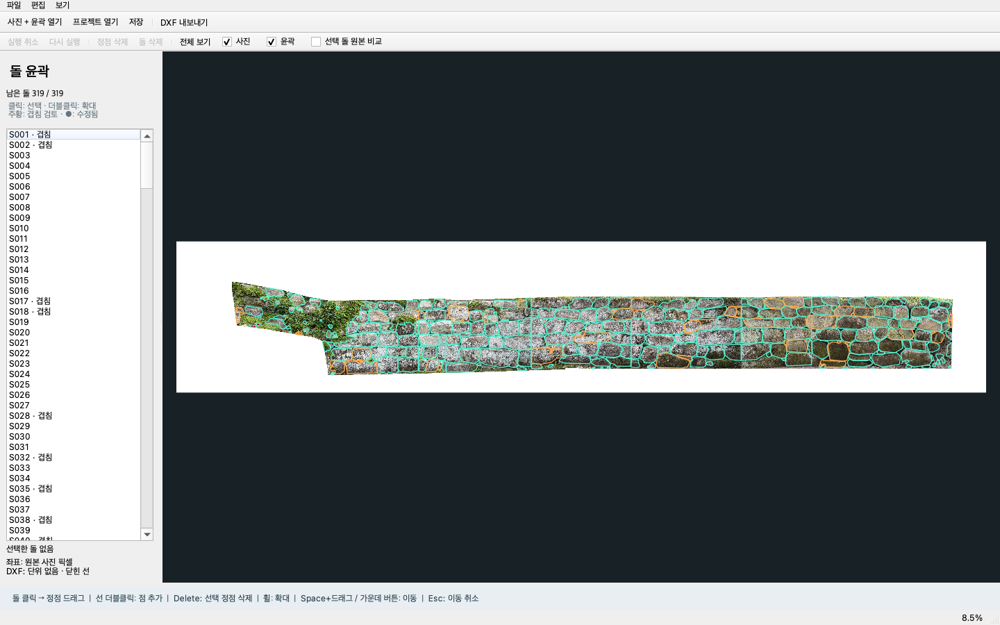
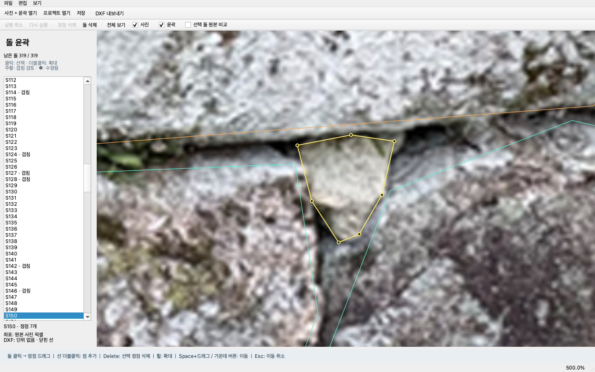

# 최소 돌 윤곽 편집기 — 구현과 사용 안내

작성일: 2026-10-02

같은 날 후속 수정: [17 — 작은 겹침 표시 누락 수정](17_overlap_display_fix.md). 현재 좌표로 겹침을 다시 계산하고 빨간 영역·상대 돌 번호를 표시합니다. 아래의 첫 구현 당시 검증 기록은 후속 수정 전 수치이며, 후속 수정까지 포함한 검증은 26개를 통과했습니다.

**합격한 319개 윤곽을 직접 수정하고, 편집 프로젝트와 DXF로 저장하는 첫 편집기를 구현했습니다.**
실제 소스는 이 Git 저장소의 `contour_editor`에 있으며,
전용 브랜치는 `codex/minimal-contour-editor`입니다. 문서는 저장소의 `docs/`에,
현장 원본 사진과 사람 작성 DXF는 저장소 바깥 `../inputoutput/`에 둡니다.

## 지금 해볼 순서

편집기 창을 macOS에 열어 두었습니다. 다시 열 때는
[run_editor.command](../run_editor.command)를 Finder에서 더블클릭하세요.
이 Mac에는 저장소의 `.venv`에 필요한 실행 환경을 설치했습니다.

터미널에서는 다음과 같이 실행합니다.

```bash
cd /Users/woody/Desktop/Wall2CAD/Wall2CAD
.venv/bin/python -m contour_editor --sample
```

1. 왼쪽 목록의 돌 번호를 **더블클릭**하여 확대합니다. 사진 위의 돌을 클릭해도 선택됩니다.
2. 튀어나온 정점을 **드래그**하여 옮깁니다. 점을 클릭하고 **Delete/Backspace**를 누르면 그 점을 삭제합니다.
3. 선 위를 **더블클릭**하면 정점이 추가됩니다. 잘못 나온 돌 전체는 **돌 삭제**로 제거합니다.
4. **실행 취소 / 다시 실행**으로 되돌릴 수 있습니다. Mac은 Cmd+Z / Cmd+Shift+Z, Windows는 Ctrl+Z / Ctrl+Y입니다.
5. **저장**으로 `*.wall2cad.json` 프로젝트를 보존합니다. 권장 위치는 저장소 밖 `inputoutput/` 또는 별도 작업 폴더입니다. 이 파일 형식은 `.gitignore`에 있어 현장 데이터가 실수로 커밋되지 않습니다.
6. **DXF 내보내기**로 수정한 윤곽만 출력합니다. AutoCAD에서 사진과 맞춘 뒤 남은 부분을 마무리합니다.

처음에는 한 구간의 돌 10개 정도를 고쳐 보며 조작이 불편한 부분과 걸린 시간을 확인하면 됩니다.
전체 돌의 재검토나 새 자료 준비가 먼저 필요하지는 않습니다.

## 화면





| 표시·조작 | 의미 |
|---|---|
| 청록색 윤곽 | 일반 후보 |
| 주황색 윤곽 | 현재 좌표에서 겹치는 돌. 빨간 영역은 실제 교집합이며, 오답 또는 합격이라는 판정은 아님 |
| 노란색 윤곽·원형 정점 | 선택한 돌 |
| 빨간색 정점 | 선택한 정점 |
| 목록의 ● | 원래 좌표와 달라진 돌 |
| 선택 돌 원본 비교 | 원래 좌표를 분홍 점선으로 함께 표시 |
| 사진 / 윤곽 체크박스 | 각각 표시·숨김 |
| 휠 | 커서 위치를 중심으로 확대·축소 |
| Space+드래그 / 가운데 버튼 드래그 | 사진 이동 |
| F / 전체 보기 | 전체 사진이 보이도록 맞춤 |
| Esc | 드래그 미리보기 취소 |

창 제목의 `*`는 프로젝트 저장이 필요하다는 뜻입니다. 후보를 처음 불러왔을 때도 새 프로젝트이므로 표시됩니다.

## 저장과 좌표

- 원래 윤곽과 편집 윤곽을 따로 보존합니다. 마스크에서 선을 다시 추출하지 않습니다.
- 저장 형식에는 사진 경로·크기·SHA256, 돌 ID, 원래 좌표, 편집 좌표, 삭제 상태, 기존 후보 메타데이터를 넣습니다.
- 사진 파일은 프로젝트에 복사하거나 포함하지 않습니다. 다른 PC로 옮길 때는 사진도 함께 옮기세요. 프로젝트의 상대 경로가 유지되면 그대로 열립니다.
- GUI에서 프로젝트를 열 때 원본 사진을 찾지 못하면 같은 사진을 다시 선택할 수 있습니다. 해시가 다른 사진은 거부합니다.
- 실행 취소 이력은 세션 내에서 유지됩니다. 저장 후 재열면 수정 결과와 원본은 유지되지만 이전 세션의 Undo 스택은 복원하지 않습니다.
- 점이 3개 미만이거나 선이 자가교차·중복되는 수정, 면적이 없는 윤곽은 적용하지 않고 하단 상태줄에 이유를 표시합니다.
- 파일은 임시 파일을 완성한 뒤 교체하며, 저장 실패 시 기존 프로젝트를 유지합니다.
- 원본 사진과 불러온 후보 JSON에는 저장·DXF 출력으로 덮어쓸 수 없습니다.
- 사진을 새로 열거나 프로젝트를 닫기 전에 미저장 작업을 저장·버리기·취소 중 선택할 수 있습니다.
- DXF 출력은 프로젝트 저장과 별개입니다. **프로젝트를 저장해야 원본 비교와 이후 편집을 이어갈 수 있습니다.**

DXF는 R2010, Unitless(단위 없음), 닫힌 LWPOLYLINE으로 내보냅니다.
`CAD x = 사진 x`, `CAD y = 사진 높이 - 사진 y`이며, 사진을 DXF에 삽입하지는 않습니다.
일반 후보는 `STONE_CANDIDATE`, 현재 좌표에서 겹치는 후보는 `REVIEW_OVERLAP` 레이어에 놓이고 돌 ID를 XDATA에 기록합니다.
기존 사람 작성 DXF의 실측 좌표에 자동 정합하는 기능은 아직 없습니다.

## 확인한 결과

검증 명령:

```bash
cd /Users/woody/Desktop/Wall2CAD/Wall2CAD
.venv/bin/python -m pytest tests/editor -q
```

**17개 테스트 모두 통과했습니다.** 코어·마우스 조작 테스트와 실제 319개 기준본 통합 테스트를 포함합니다.

| 검증 | 결과 |
|---|---|
| 사진 읽기 | 원본 13,788 × 2,574 픽셀 |
| 기준본 불러오기 | 319개 모두 유효한 닫힌 윤곽 |
| 실제 Qt 마우스 이벤트 | 점 드래그, 추가·삭제, 실행 취소·다시 실행, 돌 삭제 복구 통과 |
| 잘못된 편집 | 자가교차 거부, Esc 취소, 이웃 돌 좌표 보존 확인 |
| 프로젝트 왕복 | 원본·편집 좌표 및 삭제 상태 일치 |
| 기준본 DXF 왕복 | 319개 모두 폐합, 모든 정점 좌표 일치 |
| 시험 수정본 DXF 왕복 | 한 돌 수정·한 돌 삭제 후 318개, 모든 정점 좌표 일치 |
| DXF 구조 검사 | ezdxf audit 오류 없음 |
| 원본 보존 | 사진과 기준본 후보 JSON의 SHA256 변경 없음 |
| 화면 확인 | 오프스크린 렌더를 확인하고 실제 macOS 창 실행 확인 |
| 미저장·실패 처리 | 닫기 취소 및 저장 실패 시 파일·작업 유지 확인 |

검증 기록: [validation.json](experiments/step06_editor/validation.json)

`step06_editor`의 `qa_edited.wall2cad.json`, `qa_edited_318.dxf`는 **자동 검증용**입니다.
S001 첫 정점을 +1,+1 픽셀 이동하고 S002를 삭제했을 뿐이며, 사용자가 승인한 수정안이 아닙니다.
사용자는 `--sample`로 여는 319개 원래 기준본부터 편집하면 됩니다.

이 Mac의 Python 3.12.10 / PyQt6 6.11.0 / ezdxf 1.4.4에서 첫 구현을 검증했습니다.
겹침 수정은 [17번 문서](17_overlap_display_fix.md)를 참고하세요.
Windows 설치·실행 방법은 [소스 README](../README.md)에 준비했지만 Windows 실기기 검증은 아직 하지 않았습니다.
AutoCAD에 직접 열어 본 검증도 아직 수행하지 않았습니다. 좌표와 폐합은 파일을 재해석해 검증했습니다.

## 구현 범위와 다음 판단

이번 버전은 저장된 윤곽을 수정하는 로컬 도구입니다. SAM 재추론, 새 돌 직접 그리기, 식생·접합부 이미지 보정, 실측 좌표 정합은 포함하지 않습니다.
유료 API나 사진 업로드 없이 동작합니다. 이전 PyQt5/PyQt6 GUI와 분리해 추가했고 기존 추론 코드는 유지했습니다.

검토 메모로 남겨 주실 내용:

- 정점 이동·삭제만으로 자주 나오는 뾰족한 부분을 충분히 고칠 수 있는가?
- 클릭으로 돌·정점 선택이 편한가? 겹치는 돌은 목록에서 선택하면 해결되는가?
- 10개 정도 수정할 때 AutoCAD에서 하는 것보다 편한가? 대략 몇 분 걸리는가?
- 다음 우선순위는 새 사진 추출 연결인가, 편집 동작 보완인가?

이 결과를 보고 다음 단계로 새 사진의 반복 추론을 연결하겠습니다.
합격한 기준본 자체는 계속 그대로 유지합니다.

## Git 기록

- `baf8cd8`: 좌표 모델, 편집 이력, 프로젝트 저장·복원, DXF 출력 및 코어 검증.
- `bdd67a4`: 사진 편집 화면, 정점 조작, 파일 동작, GUI·실제 기준본 통합 검증.
- `775921b`: 실행 스크립트, 설치·사용 안내, 편집 프로젝트 Git 제외 규칙.

세 커밋 이후 Git 작업 트리는 깨끗합니다. 원격 push나 병합은 수행하지 않았습니다.
