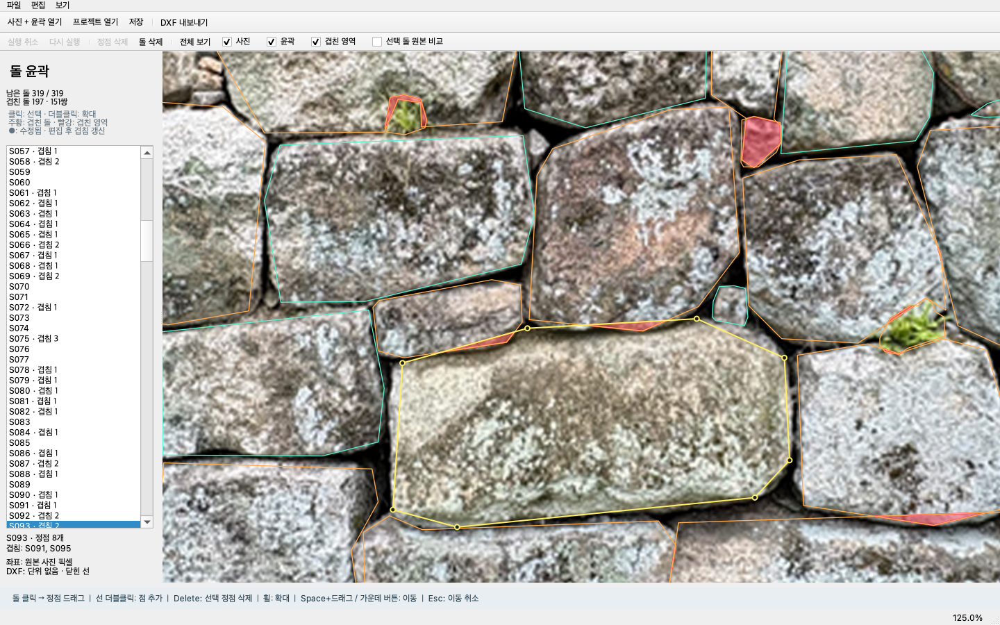

# S091–S093 / S093–S095 겹침 표시 수정

작성일: 2026-10-02

수정 커밋: `b6aba89` (`codex/minimal-contour-editor`). 커밋 후 Git 작업 트리는 깨끗합니다.

이후 [`docs/`](README.md)와 기준본 기록은 저장소로 옮겼습니다.

**사용자가 지적한 두 쌍 모두 실제 윤곽이 겹치는데 기존 표시가 누락됐습니다. 편집기가 과거의 5% 기준 표시를 그대로 사용한 것이 원인입니다.**

## 확인한 원인

기준본 생성 스크립트는 래스터화한 두 윤곽의 교집합이 작은 돌 면적의 5%를 넘을 때만
`overlap_with`와 `REVIEW_OVERLAP`을 기록했습니다. 편집기는 그 저장값으로 선 색상과 목록 표시를 결정했고,
편집 후 겹침을 다시 계산하지 않았습니다.

원본 벡터 좌표로 측정한 값:

| 돌 쌍 | 교집합 면적 (px²) | 작은 돌 면적 대비 |
|---|---:|---:|
| S091–S093 | 391.345 | 3.3566% |
| S093–S095 | 499.062 | 0.9836% |

둘 다 5% 미만입니다. 위 수치는 현재 벡터 윤곽 기준이며 과거 래스터 면적과 계산 방식이 다릅니다.

## 수정 내용

- 현재 편집 좌표로 두 윤곽의 교집합을 계산합니다. 작은 돌 면적 대비 비율로 거르지 않습니다.
- 수치 오차를 제외하기 위해 면적이 `0.000001 px²`보다 큰 겹침을 표시합니다. 꼭짓점·경계가 닿기만 하는 경우는 제외합니다.
- 완전히 포함된 돌이나 동일한 돌도 겹침에 포함합니다.
- 겹친 돌은 주황색, 교집합 영역은 반투명 빨간색으로 표시합니다. **겹친 영역** 체크박스로 빨간 영역을 숨길 수 있습니다.
- 선택한 돌 아래에 겹치는 상대 ID를 표시합니다. S093은 **S091, S095**로 표시됩니다.
- 점 이동·추가·삭제 확정, 돌 삭제, 실행 취소·다시 실행, 프로젝트 재열기 후 다시 계산합니다.
- 드래그 도중에는 이전 교집합 영역을 숨기며, 마우스를 놓아 수정을 확정하면 갱신합니다.
- DXF의 `REVIEW_OVERLAP` 레이어도 현재 겹침 상태를 사용합니다.
- 원래 후보 JSON과 그 메타데이터는 수정하지 않습니다. 자동으로 윤곽을 잘라내거나 돌을 삭제하지도 않습니다.



현재 기준본 전체에서는 **197개 돌 / 151쌍**에 면적 겹침이 있습니다.
과거 기준은 66개 돌을 표시했습니다. 윤곽을 더 많이 생성하거나 변경한 것이 아니라 작은 겹침까지 표시한 결과입니다.

## 검증

**테스트 26개 통과.** 다음을 확인했습니다.

- 사용자가 지적한 두 쌍의 실제 기준본 재현.
- 작은 겹침, 단순 접촉, 완전 포함, 동일 도형, 오목한 윤곽의 분리된 교집합.
- 편집·삭제·Undo/Redo·프로젝트 재열기 후 현재 겹침 상태.
- 목록, 상대 ID, 빨간 영역 표시 전환, DXF 레이어의 일치.
- 기존 편집·저장·좌표 보존 테스트.

검증 수치: [overlap_validation.json](experiments/step06_editor/overlap_validation.json)

계산에는 Shapely 2.1.2를 추가했습니다. 계산 API는 [공식 문서의 교집합 연산](https://shapely.readthedocs.io/en/stable/manual.html#object.intersection)을 따릅니다.
이 Mac의 편집기 가상환경에는 설치했고 다른 PC에서는 갱신한 `requirements-editor.txt`를 설치하면 됩니다.

## 적용 방법

이미 열려 있는 편집기 프로세스는 이전 코드를 실행합니다. **현재 작업을 프로젝트로 저장한 뒤 창을 닫고 다시 실행하여 저장한 프로젝트를 여세요.**
수정 중인 작업을 보호하기 위해 기존 창을 강제로 종료하거나 새 기준본으로 교체하지 않았습니다.

```bash
cd /Users/woody/Desktop/Wall2CAD/Wall2CAD
./run_editor.command
```

위 명령은 시작 화면을 엽니다. 이어 작업하려면 **프로젝트 열기**에서 저장한 `.wall2cad.json`을 선택하세요.
또는 `.venv/bin/python -m contour_editor /경로/저장한.wall2cad.json`으로 바로 열 수 있습니다.
